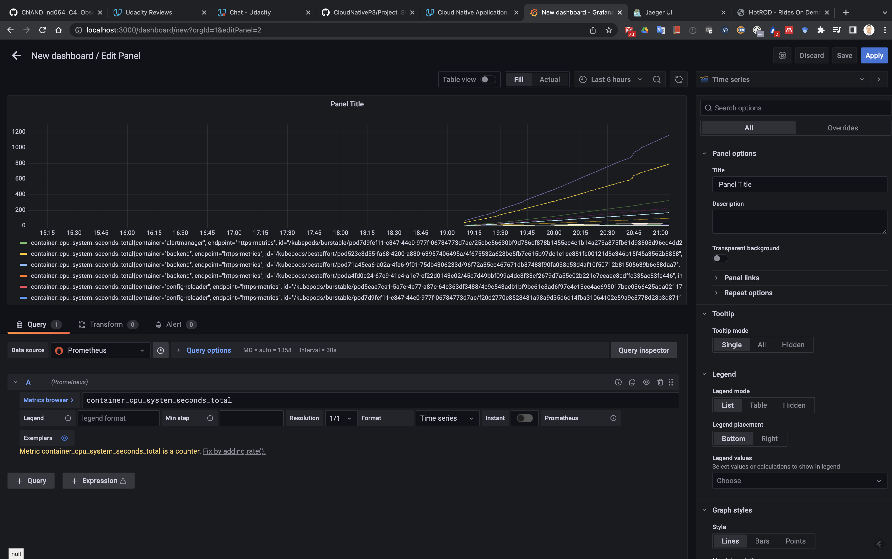
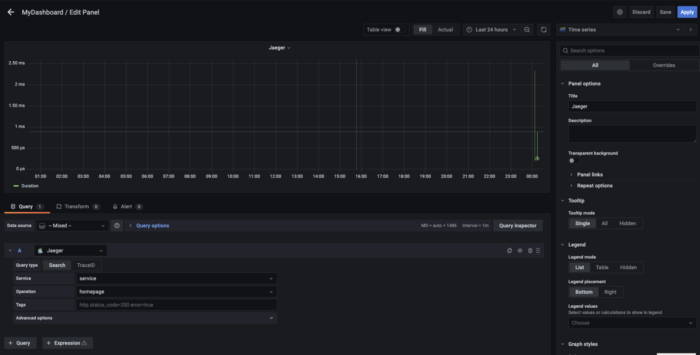

## Verify the monitoring installation

## Setup the Jaeger and Prometheus source

## Create a Basic Dashboard

## Describe SLO/SLI

Service Level Indicators (SLI) define the metrics we use to verify we are fulfilling theService Level Objectives (SLO)
* Example of a SLI related to "monthly uptime":
  *  Web service available over 99.5% of time during the last month
* Example of a SLI related to "request response time":
  * REST API average response time below 100ms

## Creating SLI metrics.

1. Latency: the time taken to serve a request (usually measured in ms)
2. Traffic: the amount of stress on a system from demand (e.g. the number of HTTP requests/second)
3. Errors: the number of requests that are failing (e.g. number of HTTP 50x responses)
4. Saturation: the overall capacity of a service (e.g. the percentage of memory or CPU used)
5. Uptime: the percentage of time of a hosting platform or a webservice has been operational and available

## Create a Dashboard to measure our SLIs

## Tracing our Flask App

## Jaeger in Dashboards

## Report Error

TROUBLE TICKET

Name: Bug found in frontend leads to error 404

Date: 04.12.2021

Subject: There is a bug in the frontend which calls a non existing API in the backend. This is causing high generation of 404 (not found)

Affected Area: Homepage

Severity: Medium

Description: When the user clicks on a button, the frontend is calling a non-existing API in the backend, which generates a 404 error

## Creating SLIs and SLOs

- Uptime of services in percentage
- CPU and memory usage in percentage
- Percentage of HTTP status code is 20x
- Average response time

## Building KPIs for our plan

- Service uptime of services must be >99.99%. This is above the 99.95% objective and therefore guaranteeing that we will be compliant.
- CPU usage must be < 80%. Getting CPU beyond this could be a problem of saturation. We should in such case scale out increasing the number of replicas.
- Memory usage must be < 80%. Getting RAM beyond this could be a problem of saturation. We should in such case scale out increasing the number of replicas.
- Average response time of HTTP requests must be < 100ms. Longer response times may be perceived as if the system is not available, pontentially leading to timeout issues.

## Final Dashboard

The first screenshot shows the dashboard including the panels for Memory usage, CPU usage and the response time of requests. Ideally, we would generate the logic to automatically trigger an alarm when the desired values are surpassed.

The second screenshot shows the last panel at the bottom, which represents the up time. This can be used to verify the system is up and running. It would be needed to calculate somewhere the percentage of time the system has been up, and trigger an alarm when the system is down and could not recover after some time (e.g. 120 seconds).

